<!-------Banner svg------>

    

<!-----Currently Building Section---->

<h2 align="left"><strong>Currently Building</strong></h2>

  I'm building practical AI applications with LLMs, agents, and Python,
  exploring how AI systems can move beyond single prompts into reliable,
  useful workflows. My background in data analysis, machine learning,
  and software development shapes how I approach building these systems.

<!-------Tech svg---->

  

<!------Pojects----->
<h2 align="left">Featured Projects</h2>

  A few things I've built while exploring AI, data, software development, and
  the process of turning ideas into working systems.

<!-- ================================================= -->
<!-- MEDIREMIND -->
<!-- ================================================= -->

<h3 align="left">MediRemind | AI Prescription Assistant
  
</h3>

  I built MediRemind around a simple problem: making printed prescriptions
  easier to turn into something a person can actually follow. The app is
  designed for <b>English and Urdu printed prescriptions</b>, using OCR to
  read the prescription, an LLM to help interpret the extracted information,
  and automated reminders to turn medicines and timings into a usable schedule.

<!-- ================================================= -->
<!-- AUDITPY -->
<!-- ================================================= -->

<h3 align="left"> AuditPy | Vulnerability Analysis Tool
  
</h3>

  AuditPy started from the idea of making open-source package risks easier
  to analyze. I built a Python pipeline around <b>OSV.dev</b> data to collect,
  clean, validate, and structure vulnerability information, turning raw
  security data into something that can actually be explored and analyzed.

<!-- ================================================= -->
<!-- E-COMMERCE -->
<!-- ================================================= -->

<h3 align="left">    E-Commerce Data Analysis
  
</h3>

  This project was about understanding the data before trying to make a model
  out of it. I worked through cleaning and preprocessing, explored patterns
  across the dataset, created visualizations, and experimented with feature
  preparation and machine-learning approaches.

<!-- ================================================= -->
<!-- US NATURAL RESOURCES -->
<!-- ================================================= -->

<h3 align="left">    US Natural Resources | EDA 2014–2018
  
</h3>

  An exploratory analysis of U.S. natural-resource data from 2014–2018.
  I focused on cleaning and understanding the dataset first, then used
  exploratory analysis and visualizations to find patterns and relationships
  that were worth investigating further.

<!-- ================================================= -->
<!-- OBSTACLE AVOIDING ROBOT -->
<!-- ================================================= -->

<h3 align="left">    Obstacle Avoiding Robot
  
</h3>

  My hardware project: an autonomous Arduino-based robot that uses ultrasonic
  sensing to detect obstacles and motor control to change its movement and
  navigate around them.

<!-- ================================================= -->
<!-- Other PROJECTS -->
<!-- ================================================= -->

<h2 align="left">Other Projects</h2>

<!-- ================================================= -->
<!-- SPLITHIVE -->
<!-- ================================================= -->

<h3 align="left">    SplitHive Track | Expense Splitting Application
  
</h3>

  A full-stack application I built in Visual Studio for managing both
  <b>personal and group expenses</b>. The idea was to make shared spending
  easier to track by recording expenses, splitting costs between people,
  and keeping the information stored locally with SQLite.

<!-- ================================================= -->
<!-- SMARTSHOP -->
<!-- ================================================= -->

<h3 align="left">    SmartShop | Java E-Commerce Application
  
</h3>

  A Java-based e-commerce application with authentication, email-based
  password recovery, session handling, and cart management. It gave me
  experience putting several parts of a typical e-commerce flow together
  rather than treating each feature in isolation.

<!-- ================================================= -->
<!-- SPELLRUN -->
<!-- ================================================= -->

<h3 align="left">    SpellRun | Grid Strategy Game
  
</h3>

  A Python console-based strategy game built around a grid, character
  abilities, and path-based decision logic. I used it to work through
  game state, movement rules, and decision-making without relying on a
  game engine.

